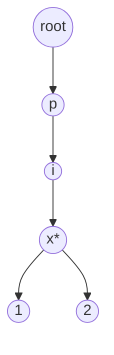

# Trie

**Category:** Trees

## The problem

A [Hash Table](../../hashing/hash-table) answers "is this exact key present?" in O(1) average,
but it can't answer "is there *any* key starting with this prefix?" without scanning every
stored key — hashing throws away any structural relationship between similar keys on purpose.
Autocomplete, prefix validation, and "does continuing to type this make sense" all need that
relationship preserved.

## The solution

Store keys character by character down a tree: each node holds its children keyed by the next
character, and one flag per node marks "a complete key ends here." Looking up a key or a prefix
means walking one character at a time from the root — cost is `O(m)` where `m` is the length of
the key or prefix, and critically, that cost has nothing to do with how many *other* keys are
stored. A trie holding 100 keys and one holding 100,000 answer the same prefix query in the
same time, because the walk only ever touches nodes along one path.



`*` marks a node where a complete key ends (e.g. `"pix"` itself is a registered key, and so are
`"pix1"` and `"pix2"`).

| Operation | Cost | Why |
|---|---|---|
| `insert(key)` | O(m) | one node created or reused per character of `key` |
| `contains(key)` | O(m) | walks the exact path for `key`, checks the end-of-word flag |
| `startsWith(prefix)` | O(m) | walks the exact path for `prefix`, existence alone is enough |

`m` = key/prefix length. None of these depend on how many other keys are stored — see the
benchmark below.

## Classic example

[`classic/Trie`](src/main/java/com/datastructures/trees/trie/classic/Trie.java) builds each
node's children as a `Map<Character, Node>` rather than a fixed 26/128-slot array, since PIX
keys aren't restricted to one alphabet (letters, digits, `@`, `.`, `+`). [`TrieTest`](src/test/java/com/datastructures/trees/trie/classic/TrieTest.java)
covers a real bug caught while writing it: the root node exists unconditionally as a field (not
created by `insert`), so `startsWith("")` on a completely empty trie would otherwise return
`true` — an empty-trie guard in `startsWith` fixes it, and the test locks the correct (`false`)
behavior in.

## Applied example: BACEN PIX-key prefix index

[`applied/PixKeyPrefixIndex`](src/main/java/com/datastructures/trees/trie/applied/PixKeyPrefixIndex.java)
validates and autocompletes PIX keys (BACEN-registered keys can be a CPF, email, phone number,
or random UUID-style key) as a user types one into a payment form, without a directory-service
round trip on every keystroke: [`hasKeyStartingWith`](src/main/java/com/datastructures/trees/trie/applied/PixKeyPrefixIndex.java)
backs the autocomplete UI, [`isRegisteredKey`](src/main/java/com/datastructures/trees/trie/applied/PixKeyPrefixIndex.java)
is the exact-match check once typing is done. [`PixKeyPrefixIndexTest`](src/test/java/com/datastructures/trees/trie/applied/PixKeyPrefixIndexTest.java)
covers both.

## Benchmark

```bash
./gradlew :trees:trie:jmh
```

Real run (JMH 1.37, JDK 26.0.2, 2 warmup + 3 measurement iterations, 1 fork). Key length is
held constant (12-character keys, `"PIX" + ` a 9-digit zero-padded number) while the *number of
stored keys* varies — the deliberately different shape from every other module's benchmark,
since the claim here is that this axis shouldn't matter at all:

| Operation | 100 keys | 10,000 keys | 100,000 keys |
|---|---:|---:|---:|
| `contains` | 102.0 ns | 98.7 ns | 98.2 ns |
| `startsWith` | 73.5 ns | 89.2 ns | 58.4 ns |

Flat within noise across a 1,000x increase in stored key count — neither operation cares how
many other keys share the trie. Contrast with [Hash Table](../../hashing/hash-table), where an
exact-match lookup is also flat by *size* but can't answer a prefix query at all without an O(n)
scan of every key.

## When not to use it

- Keys aren't naturally hierarchical/character-sequenced, or prefix queries are never needed?
  A [Hash Table](../../hashing/hash-table) gives the same O(1)-ish exact-match lookup with much
  lower memory overhead per key (a trie allocates a node per unique character position, which
  adds up for a large, low-prefix-overlap key set).
- Need range queries (all keys between X and Y), not prefix queries? A
  [Binary Search Tree](../binary-search-tree) is the better fit for that shape of question.
- Very long keys with little shared prefix structure make the per-character node overhead cost
  more than it saves — a trie earns its keep on data with real prefix locality (words, PIX
  keys, file paths, URLs), not arbitrary long strings.

## Test coverage

100% instruction coverage, 100% branch coverage (JaCoCo). Reproduce it yourself:

```bash
./gradlew :trees:trie:jacocoTestReport
```

Report at `trees/trie/build/reports/jacoco/test/html/index.html`.
