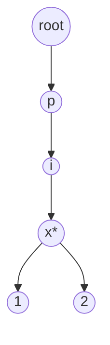

# Trie

**Categoria:** Trees

## O problema

Uma [Hash Table](../../hashing/hash-table) responde "essa chave exata existe?" em O(1) médio, mas não consegue responder "existe *alguma* chave que comece com este prefixo?" sem varrer todas as chaves armazenadas — o hashing descarta de propósito qualquer relação estrutural entre chaves parecidas. Autocompletar, validação de prefixo e "faz sentido continuar digitando isso" precisam dessa relação preservada.

## A solução

Armazene as chaves caractere por caractere ao longo de uma árvore: cada nó guarda seus filhos indexados pelo próximo caractere, e uma flag por nó marca "uma chave completa termina aqui". Buscar uma chave ou um prefixo significa percorrer um caractere de cada vez a partir da raiz — o custo é `O(m)`, em que `m` é o comprimento da chave ou do prefixo, e, fundamentalmente, esse custo não tem nada a ver com quantas *outras* chaves estão armazenadas. Uma trie com 100 chaves e uma com 100.000 respondem a mesma consulta de prefixo no mesmo tempo, porque o percurso só toca nós ao longo de um único caminho.



`*` marca um nó onde uma chave completa termina (por exemplo, `"pix"` em si é uma chave cadastrada, assim como `"pix1"` e `"pix2"`).

| Operação | Custo | Por quê |
|---|---|---|
| `insert(key)` | O(m) | um nó é criado ou reaproveitado por caractere de `key` |
| `contains(key)` | O(m) | percorre o caminho exato de `key`, verifica a flag de fim de palavra |
| `startsWith(prefix)` | O(m) | percorre o caminho exato de `prefix`, a mera existência já basta |

`m` = comprimento da chave/prefixo. Nenhuma dessas operações depende de quantas outras chaves estão armazenadas — veja o benchmark abaixo.

## Exemplo clássico

[`classic/Trie`](src/main/java/com/datastructures/trees/trie/classic/Trie.java) constrói os filhos de cada nó como um `Map<Character, Node>` em vez de um array fixo de 26/128 posições, já que as chaves PIX não estão restritas a um único alfabeto (letras, dígitos, `@`, `.`, `+`). [`TrieTest`](src/test/java/com/datastructures/trees/trie/classic/TrieTest.java) cobre um bug real encontrado durante a escrita: o nó raiz existe incondicionalmente como campo (não é criado por `insert`), então `startsWith("")` em uma trie completamente vazia retornaria `true` — uma proteção para trie vazia em `startsWith` corrige isso, e o teste trava o comportamento correto (`false`).

## Exemplo aplicado: índice de prefixo de chaves PIX do BACEN

[`applied/PixKeyPrefixIndex`](src/main/java/com/datastructures/trees/trie/applied/PixKeyPrefixIndex.java) valida e autocompleta chaves PIX (as chaves cadastradas no BACEN podem ser um CPF, e-mail, número de telefone ou uma chave aleatória no estilo UUID) enquanto o usuário digita em um formulário de pagamento, sem uma ida e volta ao serviço de diretório a cada tecla pressionada: [`hasKeyStartingWith`](src/main/java/com/datastructures/trees/trie/applied/PixKeyPrefixIndex.java) sustenta a interface de autocompletar, [`isRegisteredKey`](src/main/java/com/datastructures/trees/trie/applied/PixKeyPrefixIndex.java) é a verificação de correspondência exata quando a digitação termina. [`PixKeyPrefixIndexTest`](src/test/java/com/datastructures/trees/trie/applied/PixKeyPrefixIndexTest.java) cobre os dois casos.

## Benchmark

```bash
./gradlew :trees:trie:jmh
```

Execução real (JMH 1.37, JDK 26.0.2, 2 iterações de aquecimento + 3 de medição, 1 fork). O comprimento da chave é mantido constante (chaves de 12 caracteres, `"PIX" + ` um número de 9 dígitos com zeros à esquerda) enquanto o *número de chaves armazenadas* varia — o formato deliberadamente diferente em relação ao benchmark de todos os outros módulos, já que a afirmação aqui é que esse eixo não deveria importar em nada:

| Operação | 100 chaves | 10,000 chaves | 100,000 chaves |
|---|---:|---:|---:|
| `contains` | 102.0 ns | 98.7 ns | 98.2 ns |
| `startsWith` | 73.5 ns | 89.2 ns | 58.4 ns |

Estável dentro da margem de ruído ao longo de um aumento de 1,000x na quantidade de chaves armazenadas — nenhuma das duas operações se importa com quantas outras chaves compartilham a trie. Compare com [Hash Table](../../hashing/hash-table), em que uma busca por correspondência exata também é estável em relação ao *tamanho*, mas não consegue responder a uma consulta de prefixo de jeito nenhum sem uma varredura O(n) de todas as chaves.

## Quando não usar

- As chaves não são naturalmente hierárquicas/sequenciais em caracteres, ou consultas de prefixo nunca são necessárias? Uma [Hash Table](../../hashing/hash-table) oferece a mesma busca por correspondência exata em O(1)-ish com um overhead de memória por chave muito menor (uma trie aloca um nó por posição de caractere única, o que se acumula para um conjunto de chaves grande e com pouca sobreposição de prefixo).
- Precisa de consultas de intervalo (todas as chaves entre X e Y), não de consultas de prefixo? Uma [Binary Search Tree](../binary-search-tree) se encaixa melhor nesse tipo de pergunta.
- Chaves muito longas com pouca estrutura de prefixo compartilhada fazem o overhead de nó por caractere custar mais do que economiza — uma trie compensa em dados com localidade de prefixo real (palavras, chaves PIX, caminhos de arquivo, URLs), não em strings longas arbitrárias.

## Cobertura de testes

100% de cobertura de instruções, 100% de cobertura de branches (JaCoCo). Reproduza você mesmo:

```bash
./gradlew :trees:trie:jacocoTestReport
```

Relatório em `trees/trie/build/reports/jacoco/test/html/index.html`.
